I'm Lucas. Most of what I write is for my own machine: install scripts, desktop configs, and fixes
for hardware that doesn't play nice with Linux.

### projects

**[dotfiles](https://github.com/astxr0th/dotfiles)**: my mango + quickshell desktop. Sidebar, launcher,
screen recorder, lock screen, and colors that follow the wallpaper. One script installs it on any
Arch-based distro.

**[Artix-installer](https://github.com/astxr0th/Artix-installer)**: interactive Artix install from the
live ISO. Pick dinit, openrc, runit or s6, and ext4, xfs or btrfs.

**[aula-web-driver](https://github.com/astxr0th/aula-web-driver)**: gets AULA's browser-based keyboard
driver working on any Linux distro.

---

[astxr0th.dev](https://astxr0th.dev)
