<picture>
  <source media="(prefers-color-scheme: dark)" srcset="assets/fetch-dark.svg">
  <source media="(prefers-color-scheme: light)" srcset="assets/fetch-light.svg">
  
</picture>

### hey, I'm Lucas

Most of what I write is for my own machine: install scripts, desktop configs, and fixes for
hardware that doesn't play nice with Linux.

[`astxr0th.dev`](https://astxr0th.dev) &nbsp; [`dotfiles`](https://github.com/astxr0th/dotfiles) &nbsp; [`github`](https://github.com/astxr0th?tab=repositories)

### right now

| | |
|---|---|
| **running** | Artix with dinit and mango, every day |
| **building** | the quickshell desktop in my [dotfiles](https://github.com/astxr0th/dotfiles) |
| **learning** | C, Rust and Zig |

### projects

| | what it is | built with |
|---|---|---|
| **[dotfiles](https://github.com/astxr0th/dotfiles)** | My daily desktop: mango + a quickshell sidebar, launcher, screen recorder and lock screen. Colors follow the wallpaper. One script installs it on any Arch-based distro. | QML · bash · Lua |
| **[Artix-installer](https://github.com/astxr0th/Artix-installer)** | Installs Artix from the live ISO in one go. You pick the init system (dinit, openrc, runit, s6) and filesystem (ext4, xfs, btrfs); it sets up doas, paru and ly. | bash |
| **[aula-web-driver](https://github.com/astxr0th/aula-web-driver)** | AULA's keyboard software only runs in the browser and can't see the keyboard on Linux. This adds the udev rule and makes sure you have a browser that supports WebHID. | bash · udev |
